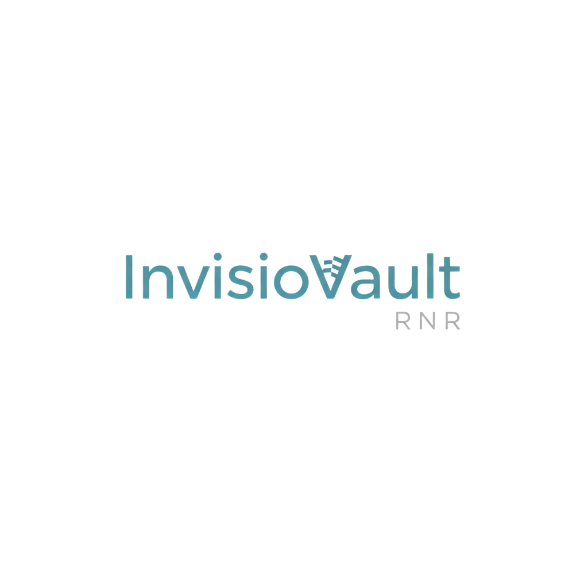

# 🔒 InvisioVault

<p align="center">
  
</p>

<p align="center">
  
  
  
  
</p>

**Hide secrets inside images, create files that are secretly two files at once, and smuggle messages inside QR codes.** It's steganography, but make it fun. 🥷

---

## 🪄 What It Does

| Mode | What's the gag |
|---|---|
| 🖼️ **Steganography** | Hide a file (or text) inside an image. Looks totally normal. Isn't. |
| 🔗 **Polyglot** | One file, two formats. Open it normally → image. Rename to `.zip` → hidden files appear. |
| 📱 **QR Code** | Phone cameras see a URL. InvisioVault sees your hidden message. 😏 |

All modes support **AES-256 encryption**. Passwords optional, paranoia encouraged.

---

## 🚀 Quick Start

**Windows:** just run `run.bat`. Done. Go make a coffee. ☕

**Everywhere else:**
```bash
# Backend
cd backend && pip install -r requirements.txt && python app.py

# Frontend (new terminal)
cd frontend && npm install && npm run dev
```
→ App at `http://localhost:5173`

---

## 🔒 Security Stuff

✅ File validation &nbsp;|&nbsp; ✅ AES-256 encryption &nbsp;|&nbsp; ✅ Rate limiting &nbsp;|&nbsp; ✅ Path traversal prevention &nbsp;|&nbsp; ✅ Auto cleanup

---

## 🎭 Origin Story (tl;dr)

This was my first ever repo. The original code was... *enthusiastic*. I came back later, actually learned things, and rebuilt it properly. If you're a beginner: just keep shipping. The cringe is part of the journey. 💪

---

## 👨‍💻 Author

**Rolan** · [rolanlobo901@gmail.com](mailto:rolanlobo901@gmail.com) · [@Mrtracker-new](https://github.com/Mrtracker-new)

**⭐ Star it if it made you feel like a hacker (the cool kind)**

> *MIT License — use it, break it, build something weird with it.*
