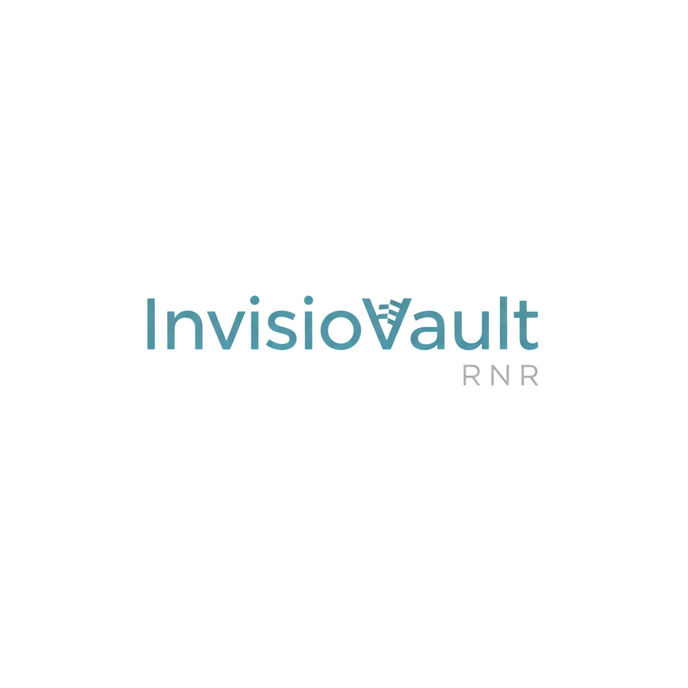

<p align="center">
  
</p>

<h1 align="center">InvisioVault</h1>

<p align="center">
  <strong>Steganography, Universal Polyglots & Stealth QR Codes</strong><br/>
  Conceal confidential files inside images, documents, audio, and scannable QR codes with authenticated encryption.
</p>

<p align="center">
  <a href="https://invisio-vault.vercel.app"></a>
  
  
  
  
  
</p>

---

## Overview

InvisioVault is an open-source cybersecurity and steganography toolkit. It allows you to conceal encrypted files inside ordinary carrier files (images, PDFs, media, and QR codes) with zero visual distortion or header corruption.

---

## Features

- **Image Steganography:** Embeds data into high-entropy image textures using Sobel edge guidance and randomized LSB matching (±1), paired with Reed-Solomon error correction to defeat statistical steganalysis.
- **Universal Polyglots:** Merges files so they open normally as images, videos, or PDFs, but extract as fully valid archives when opened in 7-Zip, WinRAR, or Archive Utility.
- **Stealth QR Codes:** Conceals encrypted payloads inside standard-looking QR codes that scan harmlessly with everyday camera apps while decrypting inside InvisioVault.

---

## Quick Start

### Windows

Run `run.bat` to launch both the backend and frontend automatically.

### Manual Setup

1. **Backend (Python 3.10+):**
   ```bash
   cd backend
   python -m venv .venv
   # Windows: .venv\Scripts\activate | Linux/macOS: source .venv/bin/activate
   pip install -r requirements.txt
   python app.py
   ```

2. **Frontend (Node 18+):**
   ```bash
   cd frontend
   npm install
   npm run dev
   ```

---

## Documentation

Comprehensive guides and technical specifications are available in the [`docs/`](docs/) directory:

| Document | Focus |
|---|---|
| [Architecture & Cryptography](docs/ARCHITECTURE.md) | Wire formats, Sobel filter mathematics, and binary offset algorithms. |
| [REST API Reference](docs/API.md) | Endpoint specifications, payloads, and examples. |
| [OpenAPI Specification](docs/openapi.yaml) | Full OpenAPI 3.0.3 schema definition. |
| [Security Policy](SECURITY.md) | Threat model, responsible disclosure, and cryptographic guarantees. |
| [Contributing Guidelines](CONTRIBUTING.md) | Local setup, standards, and pull request workflow. |
| [Changelog](CHANGELOG.md) | Version history and release notes. |

---

## Origin Story

This was my first-ever repo. The original code was *ambitious*. I came back, learned cryptography properly, and rebuilt it from scratch. If you're a beginner: keep shipping. The rough early code is proof you're growing.

---

## Author

Created and maintained by **[Rolan (RNR)](https://rolan-rnr.netlify.app/)**
- GitHub: [@Mrtracker-new](https://github.com/Mrtracker-new)
- Email: [rolanlobo901@gmail.com](mailto:rolanlobo901@gmail.com)
- Twitter/X: [@Rolan_RNR](https://x.com/Rolan_RNR)

Distributed under the [MIT License](LICENSE).
